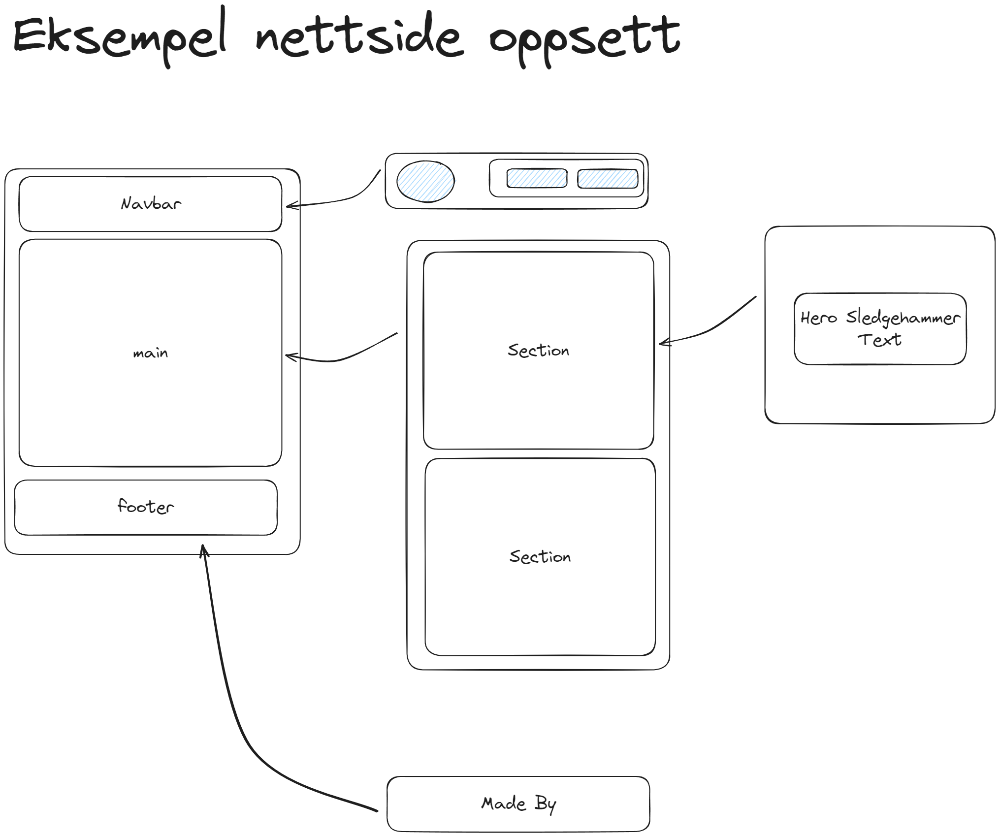

# kodeloftet-2024-gruppe-6

## Minimalistisk Side

```html
<!-- index.html -->
<!DOCTYPE html>
<html>
  <head>
    <meta charset="UTF-8" />
    <title>Kodeloftet 2024</title>

    <link rel="stylesheet" href="styles.css">
  </head>

  <body>
    <header>
      <p>Navbar</p>
    </header>

    <main>
      <section>
        <h1>First Section</h1>
        <p>Tekst</p>
      </section>
    </main>

    <footer>
      <p>Kodeloftet</p>
    </footer>
  </body>
</html>
```

```css
/* styles.css */
body {
  margin: 0px;
  width: 100vh;
  display: flex;
  flex-direction: column;
}

main {
  flex-grow: 1;
}
```

## Referanse Bilder




